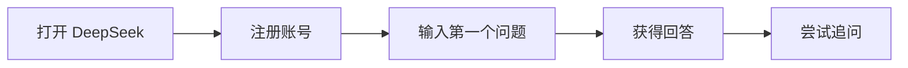

# AI 学习路径图

> 从零基础到熟练使用 AI，跟着这张路径图一步步来！

## 总览

```
┌─────────────────────────────────────────────────────────────────┐
│                     AI 学习路径图                                │
├─────────────────────────────────────────────────────────────────┤
│  第1天        第2-3天       第4-5天       第6-7天       持续进阶  │
│    ↓            ↓            ↓            ↓            ↓        │
│  [注册]  →   [对话]  →    [写作]  →    [图片]  →   [进阶]      │
│  DeepSeek    学Prompt     内容创作      AI绘画     Agent/API   │
└─────────────────────────────────────────────────────────────────┘
```

## 阶段一：入门（第1天）

### 目标：完成第一个 AI 对话



**必做任务：**
- [ ] 注册 DeepSeek 账号
- [ ] 完成第一次对话："你好，介绍一下你自己"
- [ ] 尝试问一个实际问题（如：帮我写一封请假邮件）

**推荐资源：** [ChatGPT 快速上手教程](/tutorials/chatgpt-guide)

---

## 阶段二：掌握 Prompt（第2-3天）

### 目标：学会写出高质量的提示词

```
Prompt 进阶路线：
━━━━━━━━━━━━━━━━━━━━━━━━━━━━━━━━━━━━━━━━━━━━━━━━━
简单提问 → 添加角色 → 补充背景 → 指定格式 → 多轮优化
━━━━━━━━━━━━━━━━━━━━━━━━━━━━━━━━━━━━━━━━━━━━━━━━━
```

**必做任务：**
- [ ] 学习 Prompt 六要素
- [ ] 练习 3 个不同的 Prompt 技巧
- [ ] 对比普通提问 vs 优化提问的效果

**推荐资源：** [Prompt 工程完整教程](/tutorials/prompt-engineering)

---

## 阶段三：AI 写作与办公（第4-5天）

### 目标：用 AI 提升工作效率

```
应用场景：
┌─────────────┬─────────────┬─────────────┐
│   写作      │   PPT       │   数据分析   │
├─────────────┼─────────────┼─────────────┤
│ • 文章大纲   │ • 幻灯片内容 │ • Excel公式  │
│ • 邮件撰写   │ • 演讲稿    │ • 数据可视化 │
│ • 方案策划   │ • 配图建议   │ • 报告生成   │
└─────────────┴─────────────┴─────────────┘
```

**必做任务：**
- [ ] 用 AI 写一篇 500 字的文章
- [ ] 用 AI 生成一份 PPT 大纲
- [ ] 用 AI 处理一个 Excel 问题

**推荐资源：**
- [AI 写作与PPT教程](/tutorials/ai-writing-ppt)
- [AI 学习与工作效率](/tutorials/ai-learning-work)

---

## 阶段四：AI 图片生成（第6-7天）

### 目标：学会用 AI 生成图片

```
工具选择路径：
━━━━━━━━━━━━━━━━━━━━━━━━━━━━━━━━━━━━━━━━━━━━
简单尝试        专业创作         视频探索
   ↓               ↓               ↓
 通义万相      Midjourney      可灵/Sora
 (免费)        (付费)          (视频生成)
━━━━━━━━━━━━━━━━━━━━━━━━━━━━━━━━━━━━━━━━━━━━
```

**必做任务：**
- [ ] 用 ChatGPT 或通义万相生成第一张图片
- [ ] 学习图片 Prompt 的写法
- [ ] 尝试不同风格的图片生成

**推荐资源：** [AI 图片生成教程](/tutorials/ai-image-generation)

---

## 阶段五：进阶探索（第2周起）

### 目标：深入了解 AI 能力

根据兴趣选择方向：

```
                    ┌──────────────────┐
                    │    进阶方向选择    │
                    └────────┬─────────┘
           ┌─────────────────┼─────────────────┐
           ↓                 ↓                 ↓
    ┌──────────────┐  ┌──────────────┐  ┌──────────────┐
    │   AI Agent   │  │   AI 编程    │  │   AI 创业    │
    │  智能助手    │  │   辅助开发   │  │   变现赚钱   │
    └──────────────┘  └──────────────┘  └──────────────┘
```

**方向A - AI Agent：**
- [ ] 了解什么是 AI Agent
- [ ] 用 Coze 搭建一个简单 Agent
- [ ] 探索 Manus 等通用 Agent

**方向B - AI 编程：**
- [ ] 了解 Claude Code / Trae 等 AI 编程工具
- [ ] 用 AI 辅助写一段简单代码
- [ ] 尝试用 API 接入 AI 能力

**方向C - AI 创业/变现：**
- [ ] 了解 AI 内容创作变现方式
- [ ] 探索 AI 服务接单可能

**推荐资源：**
- [AI Agent 概念与实践](/advanced/ai-agent)
- [API + Agent 部署攻略](/tutorials/api-agent-deploy)
- [AI 变现实战](/advanced/ai-monetization)

---

## 学习检查清单

### 入门阶段 ✅
- [ ] 能独立完成 AI 对话
- [ ] 知道什么是 Prompt
- [ ] 了解 AI 的基本能力

### 进阶阶段 ✅
- [ ] 能写出高质量 Prompt
- [ ] 能用 AI 处理工作任务
- [ ] 能生成 AI 图片

### 高级阶段 ✅
- [ ] 了解 AI Agent 概念
- [ ] 能使用 API 接入 AI
- [ ] 能识别 AI 幻觉和局限性

---

## 学习建议

### 每日学习时间
- **入门期**：每天 30 分钟
- **进阶期**：每天 1 小时
- **实践期**：工作中随时使用

### 学习原则
1. **先用后学**：先动手尝试，遇到问题再学理论
2. **边学边练**：每个知识点都要动手实践
3. **记录积累**：建立自己的 Prompt 库
4. **分享交流**：和朋友分享学习心得

---

> 💡 **记住**：学习 AI 最好的方式就是**多用**！从今天开始，把 AI 融入你的日常生活和工作中。

[← 返回首页](/) | [下一篇：术语中英文对照 →](/guide/terminology)
